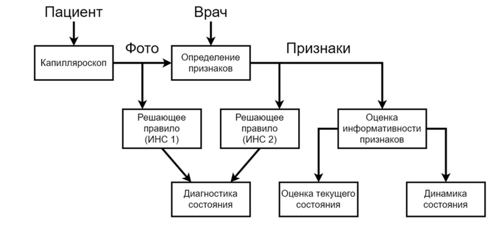

# Интеллектуальная система диагностики микроциркуляции  

## Обзор

Проект представляет собой интеллектуальную систему для диагностики состояния микроциркуляции человека на основе изображений, полученных с цифрового капилляроскопа.

Система объединяет:
- методы глубокого обучения для анализа изображений  
- параметрическую интерпретируемую модель для поддержки принятия решений  

Подход позволяет сочетать высокую точность и интерпретируемость.

⚠️ В связи с NDA и защитой интеллектуальной собственности данные и исходный код не публикуются. В репозитории представлено общее описание архитектуры и подходов.

---

## Основная идея

Микроциркуляция отражает общее состояние организма. Изменения в структуре капилляров и кровотоке могут указывать на ранние стадии различных заболеваний.

Ручной анализ:
- требует высокой квалификации  
- занимает много времени  
- подвержен ошибкам  

Цель проекта - автоматизировать диагностику и повысить её надежность с помощью AI.

---

## Архитектура системы

Система состоит из двух взаимодополняющих модулей:

### 1. Модуль глубокого обучения
- Вход: изображения капилляроскопии  
- Используемые модели:
  - ResNet-18  
  - ResNet-152  
  - ResNeXt-50_32x4d  
- Выход: классификация изображения с помощью ансамбля моделей

### 2. Параметрический (интерпретируемый) модуль
- Вход: диагностические признаки  
- Используемые методы:
  - критерий Фишера (оценка информативности признаков)  
  - корреляционный анализ (снижение избыточности)  
  - решающие правила (логика классификации)  
- Выход: классификация объекта, отображение объекта в пространстве двух наиболее информативных признаков

---

## Методология

### Подход 1: Параметрическая (интерпретируемая) модель
- Отбор информативных признаков по критерию Фишера  
- Устранение коррелирующих признаков (корреляционные плеяды)  
- Формирование признакового пространства 
- Построение зоны неопределенности
- Обучение моделей классификации (MLP, CatBoost, Keras Sequential)  
- Кросс-валидация (5 фолдов), оценка по Accuracy

### Подход 2: Глубокое обучение на изображениях
- Предобработка изображений (ресайз, нормализация)  
- Использование предобученных архитектур: ResNet-18, ResNet-152, ResNeXt-50_32x4d  
- Дообучение на целевой выборке  
- Оценка моделей: Accuracy, Precision, Recall, F1, матрица ошибок  

#### Ансамблевый подход
- Объединение трёх нейросетевых моделей методом мажоритарного голосования  
- Повышает устойчивость и общую точность классификации до 98.3%

---

*В README представлены оба подхода. В разработанной системе они реализованы как отдельные режимы работы (анализ по изображению / анализ по признакам).*

## Результаты

- Нейросетевые модели показали высокую точность классификации  
- Параметрическая модель обеспечила интерпретируемые диагностические правила  
- Гибридный подход повысил надежность системы
 
### Результаты для классификации по фото
 
| Метрика                                      | ResNet-18 | ResNet-152 | ResNeXt-50_32x4d |
|----------------------------------------------|-----------|------------|------------------|
| **Истинно положительный результат (TP)**     | 155       | 155        | 155              |
| **Истинно отрицательный результат (TN)**     | 54        | 63         | 55               |
| **Ложно положительный результат (FP)**       | 7         | 8          | 5                |
| **Ложно отрицательный результат (FN)**       | 14        | 13         | 7                |
| **Точность (Accuracy)**                      | 90.87%    | 91.30%     | 94.35%           |
| **Меткость (Precision) – Условная норма**    | 0.885     | 0.887      | 0.923            |
| **Меткость (Precision) – Патология**         | 0.917     | 0.926      | 0.951            |
| **Полнота (Recall) – Условная норма**        | 0.794     | 0.969      | 0.809            |
| **Полнота (Recall) – Патология**             | 0.957     | 0.939      | 0.960            |
| **F1-мера – Условная норма**                 | 0.837     | 0.846      | 0.939            |
| **F1-мера – Патология**                      | 0.906     | 0.937      | 0.960            |

Объединение трёх моделей с помощью ансамблевого подхода (мажоритарное голосование) повышает общую точность классификации до 98.3%

### Результаты для классификации по параметрам

| Модель               | Тест 1 | Тест 2 | Тест 3 | Тест 4 | Тест 5 | Средняя точность | 95% доверительный интервал |
|----------------------|--------|--------|--------|--------|--------|------------------|----------------------------|
| **Keras Sequential** | 98%    | 98%    | 98%    | 98%    | 95%    | 97.4%            | 86–100%                    |
| **MLPClassifier**    | 98%    | 98%    | 100%   | 100%   | 97%    | 98.6%            | 89–100%                    |
| **CatBoost**         | 100%   | 98%    | 100%   | 95%    | 97%    | 98.0%            | 88–100%                    |

Разработанное признаковое пространство позволяет не только классифицировать состояние, но и анализировать его динамику.

- Каждое исследование отображается как точка в пространстве информативных признаков  
- Изменение состояния пациента визуализируется как вектор между точками «до» и «после»  
- Направление вектора отражает характер изменений  
- Длина вектора позволяет количественно оценить динамику  

Такой подход позволяет:
- отслеживать изменения состояния микроциркуляции во времени  
- оценивать эффективность лечения  
- сравнивать различные лечебные методики  

Данная визуализация может использоваться как инструмент поддержки принятия врачебных решений.
---

## Технологии

- Python  
- PyTorch
- scikit-learn  
- Компьютерное зрение  
- Статистический анализ  
- Методы распознавания образов  

---

## Команда

Проект выполнен в рамках совместной работы.

- **Михаил Попов**
  - Участие в обучении и анализе модели ResNeXt-50_32x4d   
  - Разработка параметрической диагностической модели  
  - Отбор и анализ признаков (критерий Фишера, корреляция)  
  - Построение решающих правил    

- **Михаил Жиглин**
  - Обучение нейросетевых моделей ResNet  
  - Построение пайплайна обработки изображений  
  - Обучение и оценка моделей  
  - Реализация визуального интерфейса

---

## Сложности

- Ограниченный и зашумленный медицинский датасет
- Выборка малого размера  
- Высокая вариативность структуры капилляров  
- Баланс между точностью и интерпретируемостью  

---

## Ограничения

- Отсутствие публичного датасета  
- Закрытый исходный код  

---

## Возможные применения

- Системы поддержки врачебных решений  
- Ранняя диагностика заболеваний  
- Мониторинг состояния пациента  
- Телемедицина  

---

## Клиническая апробация

Система была протестирована в реальных условиях в рамках пилотного внедрения.

- Проведено тестирование на реальных данных  
- Подтверждена применимость для задач медицинской диагностики  
- Использовалась для оценки состояния микроциркуляции  

Полученные результаты подтвердили работоспособность системы в прикладных задачах.

## Интеллектуальная собственность

Программный продукт, разработанный в рамках проекта, зарегистрирован в Роспатенте (RU 2024613346).

